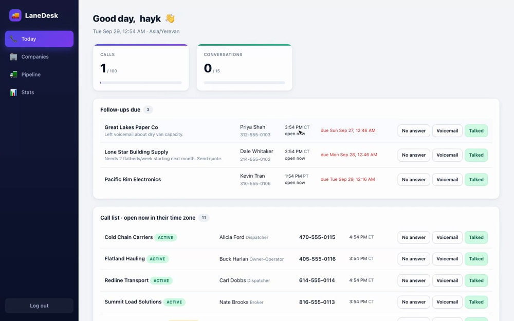

# LaneDesk CRM

A single-user CRM for a US freight sales agent: work a call list, log calls in one click, quote loads, and track them from quote to delivery, with commission stats.

Stack: Java 27, Spring Boot 4.1.1, PostgreSQL, Flyway, Thymeleaf + htmx. Phase 1 only (no AI yet).

## Demo

[](docs/lanedesk-demo.mp4)

A 3-minute walkthrough of a freight agent's day: [docs/lanedesk-demo.mp4](docs/lanedesk-demo.mp4) (captions: [.srt](docs/lanedesk-demo.srt), [.vtt](docs/lanedesk-demo.vtt); the narration is a synthetic voice). The step-by-step script is in [docs/DEMO.md](docs/DEMO.md).

## Run it

```bash
export LANEDESK_DB_PASSWORD=choose-something
export LANEDESK_DB_PORT=5432          # change if 5432 is already used on your machine
docker compose up -d                  # Postgres

export LANEDESK_USER=hayk LANEDESK_PASSWORD=choose-something
./mvnw spring-boot:run -Dspring-boot.run.profiles=dev    # `dev` loads demo data
```

Open http://localhost:8080 and sign in. Without `-Dspring-boot.run.profiles=dev` the database starts empty (use Companies → Import CSV).

Tests: `./mvnw verify` (needs Docker; Testcontainers starts its own Postgres).

## What's in it

| Page | What it does |
|---|---|
| **Today** | Follow-ups due, a call list of contacts who are in business hours *right now in their own time zone*, loads on the road, calls vs. daily target. Each row has one-click **No answer / Voicemail / Talked** buttons. |
| **Companies** | Shippers, brokers, carriers. Filter by type, status, state, equipment. Create/edit, CSV import. |
| **Company page** | Log a call (pick outcome = 1 click), notes, contacts, loads, timeline. |
| **Pipeline** | Loads by status: Quoted → Won → Covered → In transit → Delivered, or Lost. One-click moves with validation. |
| **Stats** | Calls, conversations, quotes and loads vs. targets, win rate, margin and commission. |

## Rules the app enforces
- **Do Not Call** companies never appear on Today, and calling is disabled on their page.
- Covering a load requires a carrier (type CARRIER) and a carrier cost; losing a load requires a reason.
- Weight ≤ 48,000 lbs, delivery ≥ pickup, MC number unique, a contact needs a phone or an email (also enforced in the database).
- Logging a call closes the company's open follow-ups; "Not interested" marks the company Inactive.
- Times are stored in UTC and shown in the agent's zone (Today, pipeline) or the contact's zone (their local clock).

## Settings (`application.yml`)
`lanedesk.commission-pct` (0.70), `lanedesk.agent-time-zone` (Asia/Yerevan), and `lanedesk.targets.*`.

## Assumptions and things I did not do
- **`docs/PRD.md` was not in the repo** when this was built; it was built from `docs/PLAN.md` and the task list. Check it against the PRD and correct any differences.
- Commission 70%, targets (100 calls/day, 15 conversations/day, 10 quotes/week, 5 loads/week) and agent zone are placeholders. Set your real ones.
- Commission = margin × pct, counted on booked loads (Won or later) by pickup date. Margin only exists once a carrier cost is set.
- Business hours = Mon–Fri 08:00–17:00 contact-local. US holidays are not considered.
- Quick buttons on Today set a follow-up 2 days out (no answer / voicemail) or 7 days (talked). The company page lets you choose.
- Follow-ups land at 09:00 in the agent's zone.
- Statuses only move automatically: Prospect→Contacted on a first call, →Qualified after a conversation or a quote, →Active when a load is won. Everything else is set by hand on the Edit page.
- No delete buttons (companies, contacts, loads), no editing of a contact or a load after creation, no pagination, no email sending.
- Single user only; credentials come from env vars.
